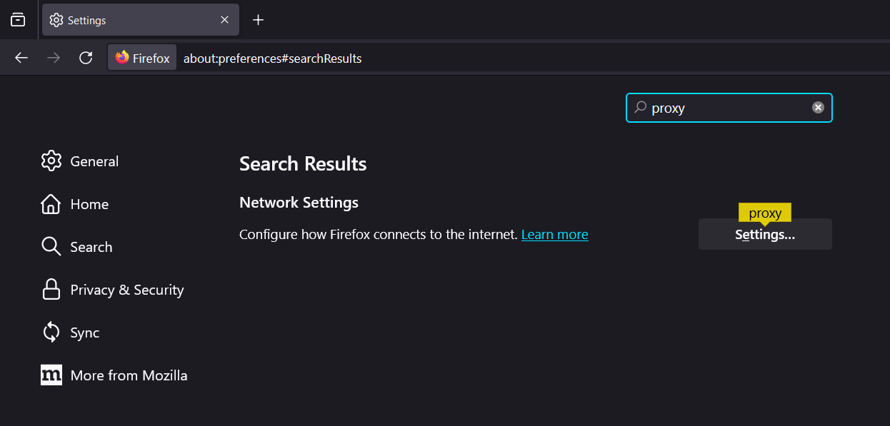
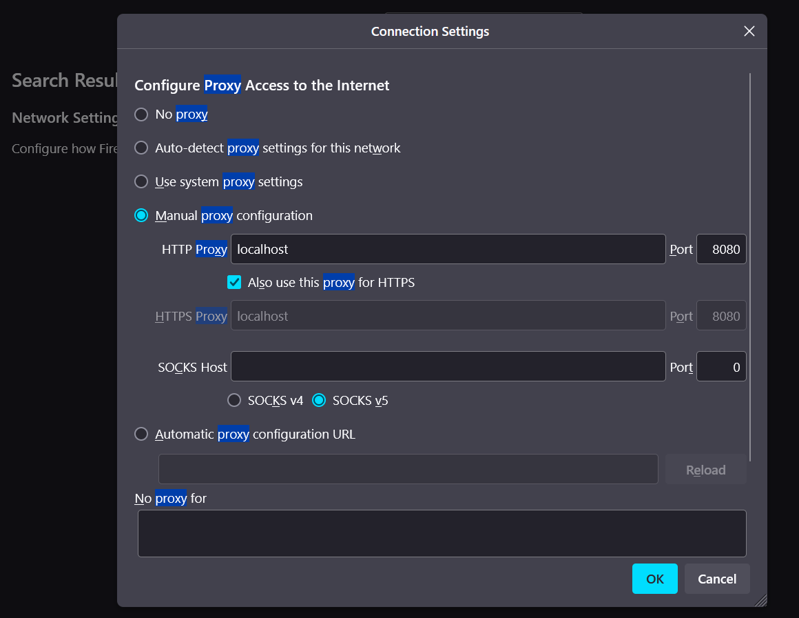
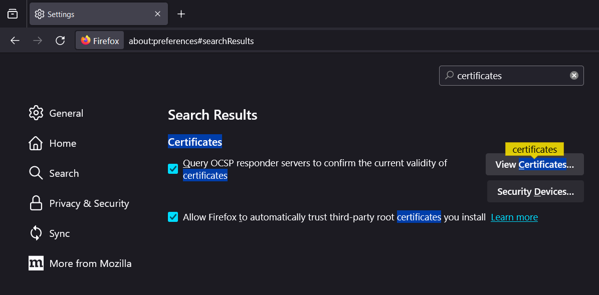
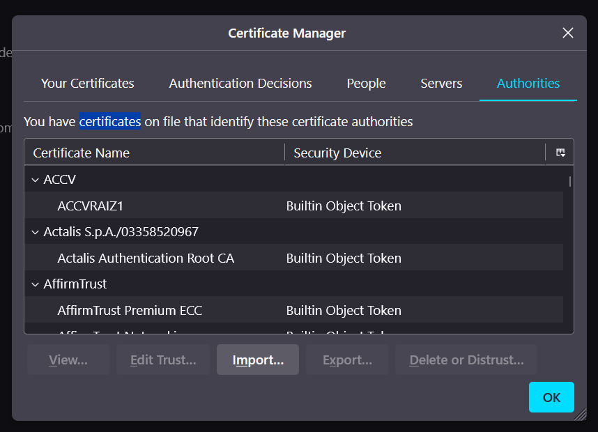
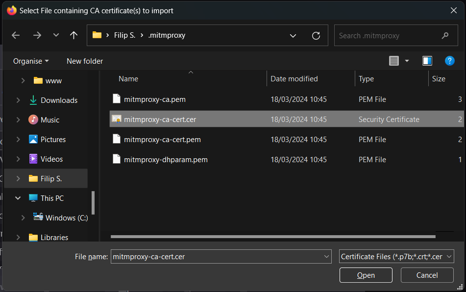
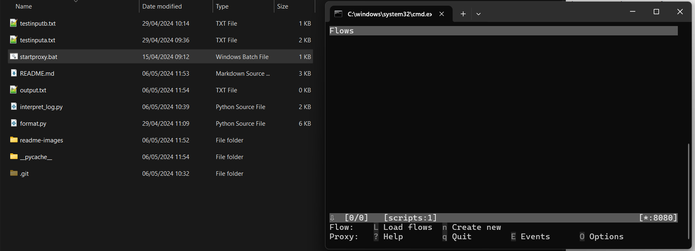
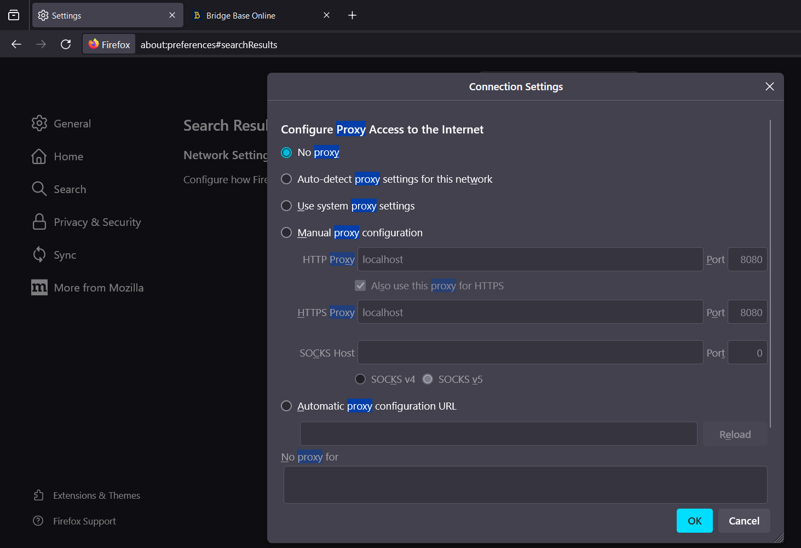

# Bridgebase Protocol

This is a simple program that just logs [Bridge Base Online](https://bridgebase.com/) games. 

## Installation
In the following you will see an example installation with Windows 11 and Firefox.

### Step 1: Installing the necessary tools and dependencies

For this tutorial you will need:
- **Firefox**, which you can get [here](https://www.mozilla.org/en-US/firefox/new/).
- **Python**, which you can get [here](https://www.python.org/downloads/).
- **Mitmproxy**, which you can get [here](https://www.mitmproxy.org/downloads/) and/or using pip by running the following command in any terminal window:

```
python.exe -m pip install mitmproxy
```

Make sure the location of your Python installation is in the PATH environment variable.

### Step 2: Firefox Setup

1. Open up Firefox and put `about:preferences` in the address bar. 

2. Search for "Proxy" in the "Find in Settings" search bar:


3. The first result is what we need. Click on the "Settings..." button that is highlighted. 

4. A window will open. You need to input following information:


A quick overview of what you'll need to do:
- Check "Manual proxy configuration"
- Set "HTTP Proxy" to `localhost`
- Set "Port" to `8080`
- Check the box "Also use this proxy for HTTPS"

5. Now you can click on OK to save. 

**Warning**: With this enabled, Firefox will give you a warning that "The proxy server is refusing connections" if you don't have the script enabled. If you would like to undo this, simply repeat steps 1 to 3 and check "No proxy" in the Connection Settings. 

### Step 2.1: Add the mitmproxy certificate to Firefox

1. Go to `about:preferences` again.
2. Search for "certificates":

3. Click on "View Certificates...". A window will pop up:
 
4. Make sure you are in the "Authorities" tab and click on "Import..."
5. A file selection screen will open. Type in `%USERPROFILE%\.mitmproxy` into the explorer bar. Select the `mitmproxy-ca-cert.cer` file and press on Open.

6. Press on "OK" and you should be good to go! You will only need to do this step once.

### Step 3: Running the program

Now you should be able to simply double-click `startproxy.bat` in the explorer to run the proxy! You don't need to touch the console window that appears, just don't close it until you're done. 


### Step 4: Playing BBO and Logging

While the program is running, you can visit [Bridge Base Online](https://bridgebase.com/) and play! This program will log the cards getting played and the responses, including some information when the game is finished. 

The log is updated real-time in `./output.txt`. 

**Warning**: When you restart the program the `output.txt` file will be overwritten.

### Step 5: Exiting the program

Simply close the console window that appeared in step 3 to close the proxy. 

**However**, if you're trying to use Firefox without the proxy enabled, it will tell you that "The proxy server is refusing connections". To fix this, simply repeat points 1-3 of step #2, and make sure to check "No proxy" and click "OK":


To then run the program again you'll have to check "Manual proxy configuration" again using step #2.